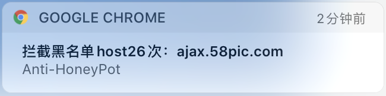
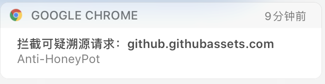

# 背景
在真实攻防演习中，蓝队不再像以前只是被动防守，而是慢慢开始转变到主动出击的角色。  
对蓝队反制红队帮助最大的想来非蜜罐莫属，现在的商业蜜罐除了会模拟一个虚拟的靶机之外，还承担了一个很重要的任务：溯源黑客真实身份。相当一部分黑客因为浏览器没开隐身模式导致被利用jsonhijack漏洞抓到真实ID，虽然可以反手一个举报到src换积分，但是在漏洞修复之前，又是一批战友被溯源。相信很对已经被溯源的红方选手对此更有体会。  
在这种背景下，各位红方老司机应当很需要一个能自动识别这种WEB蜜罐，因此我们写了个简单的chrome插件，用来帮助我们摆脱被溯源到真实ID的困境。

# 原理
此插件有两个功能，一是识别当前访问的网站是否是蜜罐，是的话就弹框预警；二是对访问的jsonp接口进行重置，防止对方获取到真实ID。  

所采用的原理非常简单粗暴，就是判断当前网站域和jsonp接口的域是否是同一个，是的话就预警并阻断。比如我访问一个的网站，结果这个网站里的js去请求了一个baidu.com的api，那妥妥的有问题了。

但是粗暴判断也会带来误报，比如我正常访问baidu.com，但是其引用了个apibaidu.com的jsonp，就一样也会报警和拦截，这种情况下就暂时用白名单来解决了。

具有黑名单host匹配功能：如果匹配到基于蜜罐溯源黑名单的host，会做另外的弹框预警，如果有多个黑名单host弹框报警，说明这个蜜罐的可能性会比较大。

拦截顺序：
1. 白名单不拦截
2. 拦截黑名单host，发出黑名单拦截报警
3. 一般拦截，发出可疑报警

黑名单拦截：

一般拦截：
  

# chrome插件使用
1. 下载并解压源码  
2. 打开chrome的插件管理 chrome://extensions/  
3. 打开开发者模式，并点击”加载已解压的扩展程序”，选择对应的目录导入即可  
